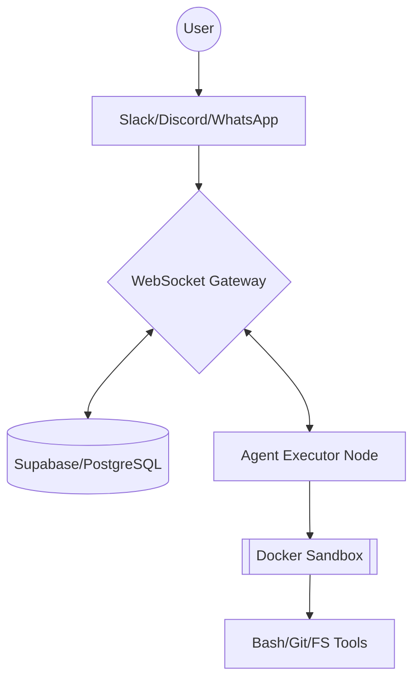

# 🔱 OpenClaw / Pi-Mono

> **Poe-mono**: A high-performance, autonomous AI agent system built on the `pi-mono` foundation.

<p align="center">
  
</p>

This monorepo contains a complete suite of tools for building and deploying production-ready autonomous AI agents. It features a distributed architecture that connects platform channels (Slack, Discord) to isolated execution nodes via a central WebSocket Gateway.

## 🌟 Key Features

- **Distributed Architecture**: Multi-platform support (Slack, Discord, WhatsApp) via the central **WebSocket Gateway**.
- **Secure Sandboxing**: All tool execution happens in isolated **Docker** containers, protecting your host machine.
- **Unified AI API**: Support for Claude, GPT, Gemini, and DeepSeek via a single interface.
- **Persistent Memory**: Session history and long-term facts stored in **PostgreSQL (Supabase/Neon)**.
- **Autonomous Tooling**: The agent can install its own tools, write code, and configure its own environment.

## 📦 Packages

| Package | Description |
|---------|-------------|
| **[@mariozechner/pi-gateway](packages/gateway)** | **NEW**: WebSocket control plane for autonomous agent coordination. |
| **[@mariozechner/pi-agent-core](packages/agent)** | Agent runtime with tool calling and state management. |
| **[@mariozechner/pi-ai](packages/ai)** | Unified multi-provider LLM API. |
| **[@mariozechner/pi-coding-agent](packages/coding-agent)** | Interactive coding agent CLI. |
| **[@mariozechner/pi-mom](packages/mom)** | Slack bot implementation with Docker sandboxing. |
| **[@mariozechner/pi-tui](packages/tui)** | Terminal UI library for rich interactive CLIs. |
| **[@mariozechner/pi-web-ui](packages/web-ui)** | Web components for agent chat interfaces. |

## 🚀 Quick Start

### 1. Gateway Deployment (The Control Plane)
The Gateway handles session routing and persistence.

```bash
cd packages/gateway
npm install
npm run build
# Configure environment variables (SUPABASE_URL, SUPABASE_KEY)
node dist/main.js server
```

### 2. Node Setup (The Execution Environment)
Nodes connect to the Gateway to execute tasks.

```bash
cd packages/gateway
# Configure GATEWAY_URL and ANTHROPIC_API_KEY
node dist/main.js executor
```

### 3. Database Setup
Run the provided SQL in `packages/gateway/schema.sql` on your Supabase or Neon instance to enable persistence.

## 🛠️ Development

```bash
npm install          # Install all dependencies
npm run build        # Build all packages
npm run check        # Lint, format, and type check
npm test             # Run unit tests across the monorepo
```

## 🏗️ Architecture



## 📜 Documentation

- [OpenClaw Implementation Plan](OPENCLAW_PLAN.md)
- [Future Feature Roadmap](FEATURE_IDEAS.md)
- [Slack Bot Setup Guide](packages/mom/docs/slack-bot-minimal-guide.md)

## License

MIT
